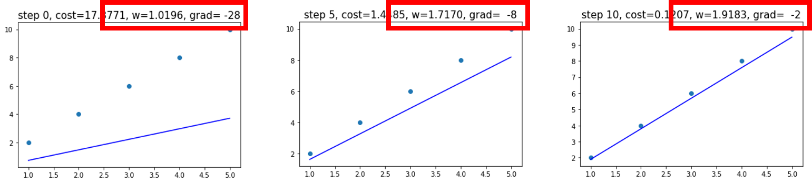
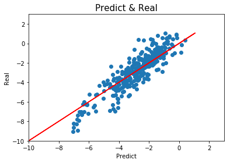
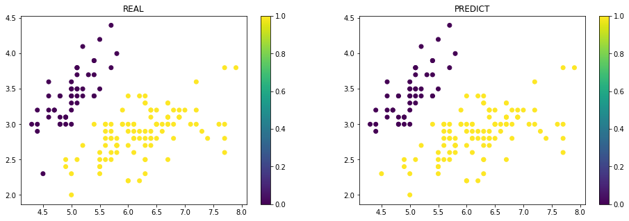

## PyTorch-Basic

This repository aims to provide useful codes for people want to learn "Pytorch". It covers python basic to most popular models of Deep Learning and useful skills with data from various sources. The meterials are provided as '.ipynb' file available with Jupyter Notebook. Almost every three months, ALL CODES will be updated and re-uploaded.

본 레퍼지토리는 "Pytorch"를 배우고자 하는 사람들을 위해 제공되는 목적으로 생성되었습니다. Python 기초부터 CNN, GAN 등을 포함한 유명한 딥러닝(Deep Learning) 모델 및 구현에 필요할 수 있는 유용한 스킬을 다루고 있습니다. 모든 자료는 '.ipynb' 파일로 제공되며, 이는 Jupyter Notebook으로 실행하실 수 있습니다. 매 3달마다 모든 코드가 업데이트 된 후 다시 업로드됩니다.

### Course List  
#### 1. [Week1](Week1) : Python Basic / Tensor
- Python Basic
	- Jupyter Notebook
	- Data Type
	- IF/WHILE/FOR
	- Collection
	- Extra
	- Data Import
- Tensor
	- Tensor Basic
	- Tensor with characteristics
	- Tensor and Numpy
	- Tensor Slicing
	- Tensor Merging
	- Tesnorr Reshaping
	- Tensor for GPU
	- Tensor Calculation
	- Tensor Casting
	- Tensor Statistic
	- Tensor *_like function
	- Tensor Calculation as Matrix

#### 2. [Week2](Week2) : Variable & Autograd / Regression / Classification
- Variable & Autograd
	- Autograd
	- Backward
	- detach vs data
- Linear Regression
	- Generate Data
	- Derive Normal Equation
	- Define Model

- Multivariate Linear Regression
	- Solubility Data
	- Define Model
	- Train & Test Model

- Logistic Regression
	- Iris Data
	- Define Model
	- Train & Test Model

#### 3. [Week3](Week3) : Activation Function / Neural Network / Convolution Neural Network

#### 4. [Week4](Week4) : Methods for Improving Model / Improving CNN / Advanced CNN & Transfer Learning

#### 5. [Week5](Week5) : Natural Language Processing / Bag of Words / Word2Vec

#### 6. [Week6](Week6) : RNN / GRU / LSTM

#### 7. [Week7](Week7) : AE / VAE / SVHN

#### 8. [Week8](Week8) : GAN / DCGAN / cGAN / Pix2Pix